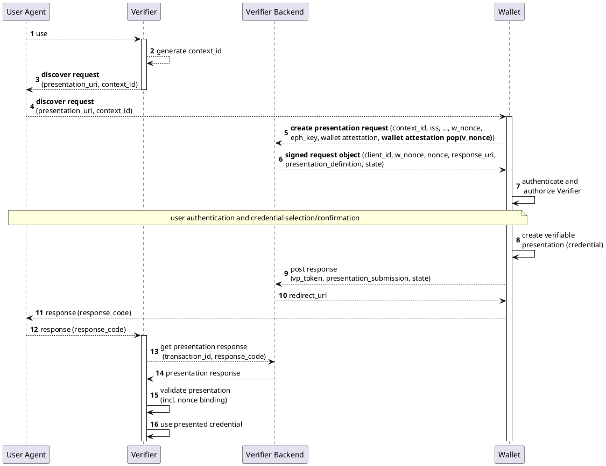

```plantuml
@startuml

autonumber

participant "User Agent" as u

participant "Verifier" as r

participant "Verifier Backend" as rb

participant "Wallet" as w

u --> r : use
activate r
r --> r: generate context_id

r --> u: **discover request**\n(presentation_uri, context_id)
deactivate r
u --> w: **discover request**\n(presentation_uri, context_id)
activate w
w --> rb: **create presentation request** (context_id, iss, ..., w_nonce, \neph_key, wallet attestation, **wallet attestation pop(v_nonce)**)
rb --> w: **signed request object** (client_id, w_nonce, nonce, response_uri, \npresentation_definition, state)
w -> w: authenticate and\n authorize Verifier

note over u, w: user authentication and credential selection/confirmation

w -> w: create verifiable\npresentation (credential)
w --> rb: post response \n(vp_token, presentation_submission, state)
rb --> w: redirect_url
w --> u: response (response_code)
u --> r: response (response_code)
activate r
r --> rb: get presentation response\n (transaction_id, response_code)
rb --> r: presentation response
r -> r: validate presentation \n(incl. nonce binding)
r -> r: use presented credential 
@enduml
```