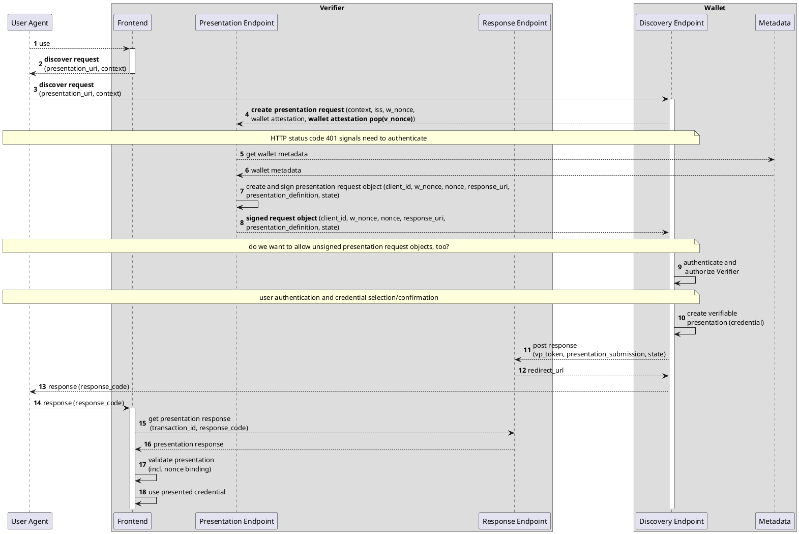

```plantuml
@startuml

autonumber

participant "User Agent" as u

box "Verifier"
participant "Frontend" as r
participant "Presentation Endpoint" as rp
participant "Response Endpoint" as rb
end box

box "Wallet"
participant "Discovery Endpoint" as w
participant "Metadata" as wm
end box

u --> r : use
activate r

r --> u: **discover request**\n(presentation_uri, context)
deactivate r
u --> w: **discover request**\n(presentation_uri, context)
activate w
w --> rp: **create presentation request** (context, iss, w_nonce, \nwallet attestation, **wallet attestation pop(v_nonce)**)
note over u, w: HTTP status code 401 signals need to authenticate
rp --> wm: get wallet metadata
wm --> rp: wallet metadata
rp -> rp: create and sign presentation request object (client_id, w_nonce, nonce, response_uri, \npresentation_definition, state)
rp --> w: **signed request object** (client_id, w_nonce, nonce, response_uri, \npresentation_definition, state)
note over u, w: do we want to allow unsigned presentation request objects, too?
w -> w: authenticate and\n authorize Verifier

note over u, w: user authentication and credential selection/confirmation

w -> w: create verifiable\npresentation (credential)
w --> rb: post response \n(vp_token, presentation_submission, state)
rb --> w: redirect_url
w --> u: response (response_code)
u --> r: response (response_code)
activate r
r --> rb: get presentation response\n (transaction_id, response_code)
rb --> r: presentation response
r -> r: validate presentation \n(incl. nonce binding)
r -> r: use presented credential 
@enduml
```