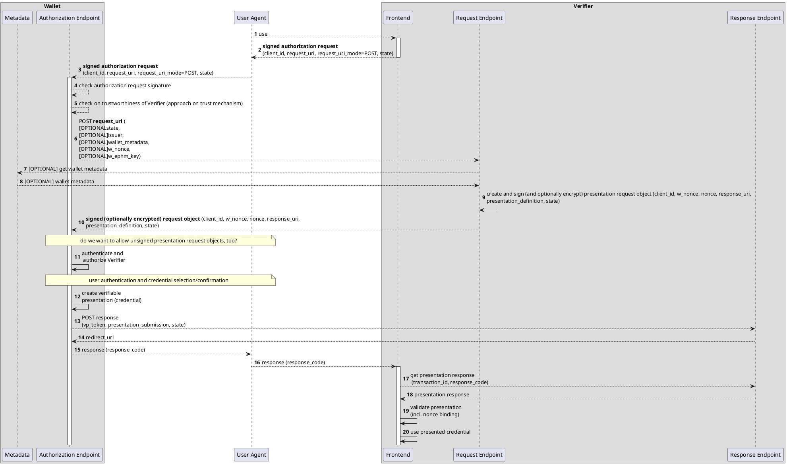

```plantuml
@startuml

autonumber

box "Wallet"
participant "Metadata" as wm
participant "Authorization Endpoint" as w
end box

participant "User Agent" as u

box "Verifier"
participant "Frontend" as r
participant "Request Endpoint" as rp
participant "Response Endpoint" as rb
end box

u --> r : use
activate r

r --> u: **signed authorization request**\n(client_id, request_uri, request_uri_mode=POST, state)
deactivate r
u --> w: **signed authorization request**\n(client_id, request_uri, request_uri_mode=POST, state)
activate w
w --> w: check authorization request signature
w --> w: check on trustworthiness of Verifier (approach on trust mechanism)
w --> rp: POST **request_uri** (\n[OPTIONALstate,\n[OPTIONAL]issuer, \n[OPTIONAL]wallet_metadata, \n[OPTIONAL]w_nonce, \n[OPTIONAL]w_ephm_key)
rp --> wm: [OPTIONAL] get wallet metadata
wm --> rp: [OPTIONAL] wallet metadata
rp -> rp: create and sign (and optionally encrypt) presentation request object (client_id, w_nonce, nonce, response_uri, \npresentation_definition, state)
rp --> w: **signed (optionally encrypted) request object** (client_id, w_nonce, nonce, response_uri, \npresentation_definition, state)
note over u, w: do we want to allow unsigned presentation request objects, too?
w -> w: authenticate and\n authorize Verifier

note over u, w: user authentication and credential selection/confirmation

w -> w: create verifiable\npresentation (credential)
w --> rb: POST response \n(vp_token, presentation_submission, state)
rb --> w: redirect_url
w --> u: response (response_code)
u --> r: response (response_code)
activate r
r --> rb: get presentation response\n (transaction_id, response_code)
rb --> r: presentation response
r -> r: validate presentation \n(incl. nonce binding)
r -> r: use presented credential 
@enduml
```