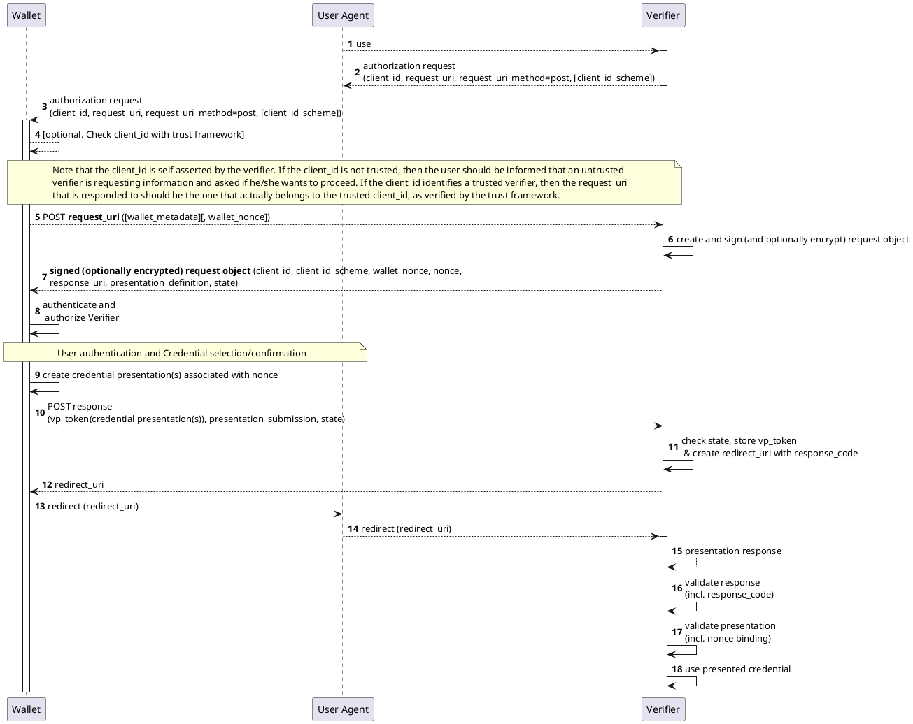

```plantuml
@startuml

autonumber

participant "Wallet" as w

participant "User Agent" as u

participant "Verifier" as r

u --> r : use
activate r

r --> u: authorization request\n(client_id, request_uri, request_uri_method=post, [client_id_scheme])
deactivate r
u --> w: authorization request\n(client_id, request_uri, request_uri_method=post, [client_id_scheme])
activate w
w --> w: [optional. Check client_id with trust framework]
note over r,w
    Note that the client_id is self asserted by the verifier. If the client_id is not trusted, then the user should be informed that an untrusted 
    verifier is requesting information and asked if he/she wants to proceed. If the client_id identifies a trusted verifier, then the request_uri 
    that is responded to should be the one that actually belongs to the trusted client_id, as verified by the trust framework.
end note
w --> r: POST **request_uri** ([wallet_metadata][, wallet_nonce])
r -> r: create and sign (and optionally encrypt) request object 
r --> w: **signed (optionally encrypted) request object** (client_id, client_id_scheme, wallet_nonce, nonce, \nresponse_uri, presentation_definition, state)
w -> w: authenticate and\n authorize Verifier

note over u, w: User authentication and Credential selection/confirmation

w -> w: create credential presentation(s) associated with nonce
w --> r: POST response \n(vp_token(credential presentation(s)), presentation_submission, state)
r -> r: check state, store vp_token\n & create redirect_uri with response_code
r --> w: redirect_uri
w --> u: redirect (redirect_uri)
u --> r: redirect (redirect_uri)
activate r
r --> r: presentation response
r -> r: validate response \n(incl. response_code)
r -> r: validate presentation \n(incl. nonce binding)
r -> r: use presented credential 
@enduml
```