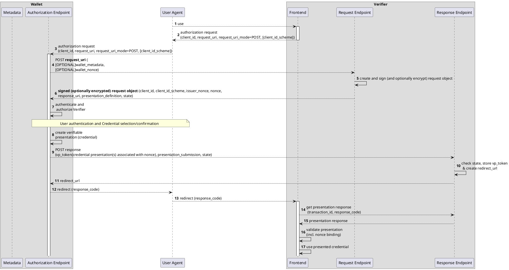

```plantuml
@startuml

autonumber

box "Wallet"
participant "Metadata" as wm
participant "Authorization Endpoint" as w
end box

participant "User Agent" as u

box "Verifier"
participant "Frontend" as r
participant "Request Endpoint" as rp
participant "Response Endpoint" as rb
end box

u --> r : use
activate r

r --> u: authorization request\n(client_id, request_uri, request_uri_mode=POST, [client_id_scheme])
deactivate r
u --> w: authorization request\n(client_id, request_uri, request_uri_mode=POST, [client_id_scheme])
activate w
w --> rp: POST **request_uri** (\n[OPTIONAL]wallet_metadata, \n[OPTIONAL]wallet_nonce)
rp -> rp: create and sign (and optionally encrypt) request object 
rp --> w: **signed (optionally encrypted) request object** (client_id, client_id_scheme, issuer_nonce, nonce, \nresponse_uri, presentation_definition, state)
w -> w: authenticate and\n authorize Verifier

note over u, w: User authentication and Credential selection/confirmation

w -> w: create verifiable\npresentation (credential)
w --> rb: POST response \n(vp_token(credential presentation(s) associated with nonce), presentation_submission, state)
rb -> rb: check state, store vp_token\n & create redirect_url
rb --> w: redirect_url
w --> u: redirect (response_code)
u --> r: redirect (response_code)
activate r
r --> rb: get presentation response\n (transaction_id, response_code)
rb --> r: presentation response
r -> r: validate presentation \n(incl. nonce binding)
r -> r: use presented credential 
@enduml
```