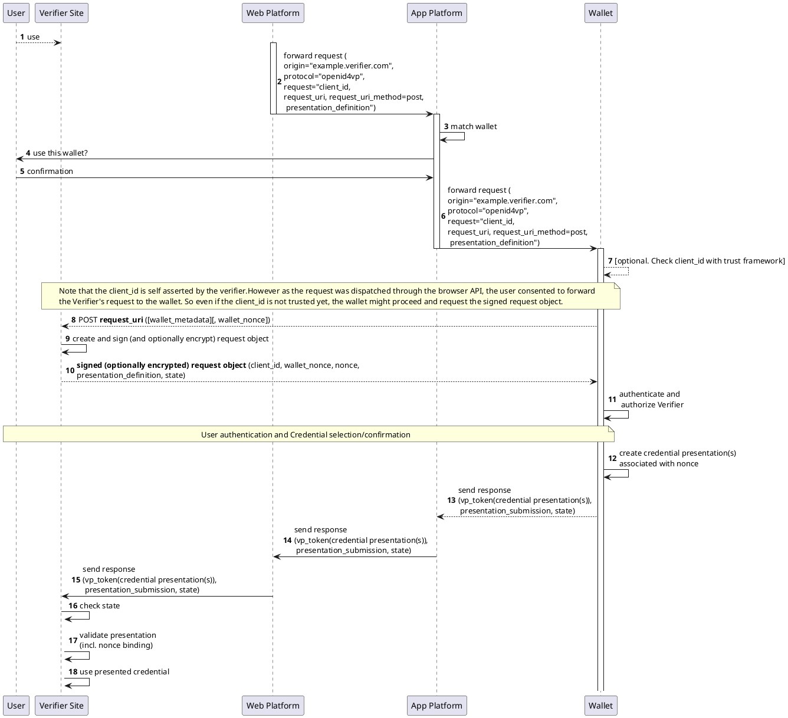

```plantuml
@startuml

autonumber

participant "User" as u

participant "Verifier Site" as r

participant "Web Platform" as wp

participant "App Platform" as ap

participant "Wallet" as w

u --> r : use

deactivate r
activate wp

wp -> ap: forward request (\norigin="example.verifier.com",\nprotocol="openid4vp",\nrequest="client_id, \nrequest_uri, request_uri_method=post,\n presentation_definition")
deactivate wp
activate ap

ap -> ap: match wallet
ap -> u: use this wallet?
u -> ap: confirmation

ap -> w: forward request (\norigin="example.verifier.com",\nprotocol="openid4vp",\nrequest="client_id, \nrequest_uri, request_uri_method=post,\n presentation_definition")
deactivate ap

activate w
w --> w: [optional. Check client_id with trust framework]
note over r,w
    Note that the client_id is self asserted by the verifier.However as the request was dispatched through the browser API, the user consented to forward 
    the Verifier's request to the wallet. So even if the client_id is not trusted yet, the wallet might proceed and request the signed request object.
end note
w --> r: POST **request_uri** ([wallet_metadata][, wallet_nonce])
r -> r: create and sign (and optionally encrypt) request object 
r --> w: **signed (optionally encrypted) request object** (client_id, wallet_nonce, nonce, \npresentation_definition, state)
w -> w: authenticate and\n authorize Verifier

note over u, w: User authentication and Credential selection/confirmation

w -> w: create credential presentation(s) \nassociated with nonce
w --> ap: send response \n(vp_token(credential presentation(s)),\n presentation_submission, state)
ap -> wp: send response \n(vp_token(credential presentation(s)),\n presentation_submission, state)
wp -> r: send response \n(vp_token(credential presentation(s)),\n presentation_submission, state)
r -> r: check state
activate r
r -> r: validate presentation \n(incl. nonce binding)
r -> r: use presented credential 
@enduml
```